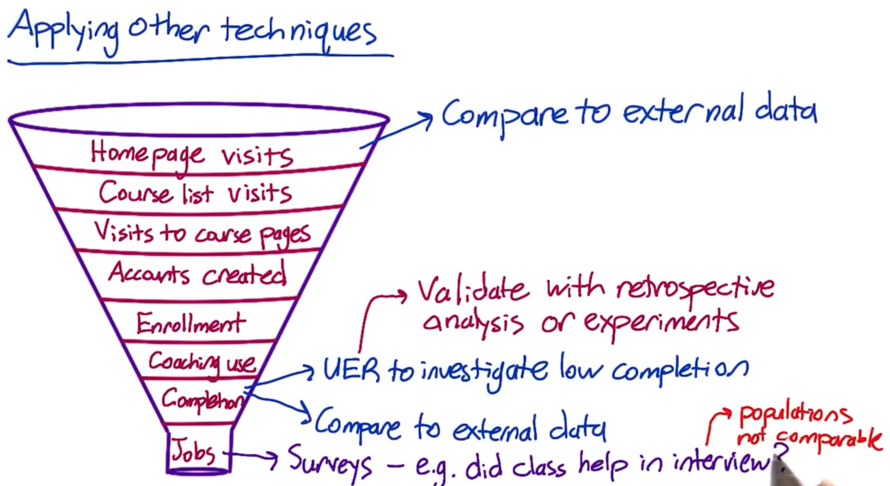
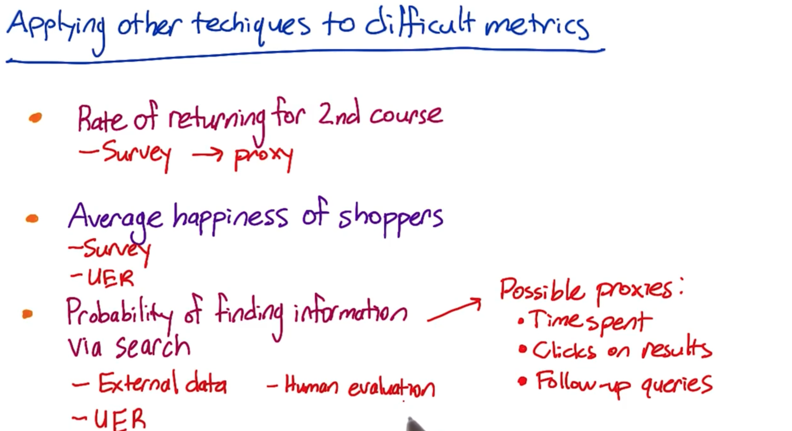

# A/B Testing

Experimentation ranging from the underlying infrastructure, to design metrics and dashboards, to running and analyzing experiments to the processing culture needed to facilitate data-driven solutions

## What is A/B testing?

A/B testing is a general methodology used online when you wanna test out a new product or a feature. And what you're doing is you are going to take two sets of users and you will show one set, a control set, your existing product or feature, and then another set, your experiment, the new version.

Then, you will examine how did these users from two groups respond differently in order to determine which version of your feature is better.

-   **Example:**

    -   It can be a novel big change or addition in product or feature like when Amazon initially decided to launch their first personalized product recommendations feature based on A/B testing results that showed a huge increase in revenue by adding this new feature.

    -   It can also be a very small or trivial feature such as when Google tested 41 different shades of blue.

-   **The key thing in A/B testing** is that you have a `consistent response` from your control and experiment group so that you can actually `determine and structure the experiment` to determine whether there is `a significant behavior change` in your experiment group.

-   **The goal in A/B testing** is to design an experiment that is gonna be `robust` and give you `repeatable results` so that you can actually make a good decision about whether or not to actually launch that product or feature.

-   **A/B Testing compared to hypothesis testing in traditional fields of study**: In traditional fields of study such as clinical trials in psychology or medical research, we know a lot of information about participants such as their demographics, and we usually have a relatively small number of participants. However, when testing an `online` product, we might have millions of users, hundreds or thousands of clicks, etc., and we DO NOT know much about who is taking those actions on the other end.

## What you can't do with A/B testing?

**`Case 1: New Experiences`** (e.g. premium service that offers additional functionality)

(p.s. to access premium, user need to upgrade, create a log-in, and explore new functionality)

-   A/B testing isn't useful when you wanna test out `new experiences`. Because when you are testing a new experience, you have an existing set of users and they might feel that you have changed their experience and they preferred their old way (and this is `change aversion`). The other case is that they can be really like this new experience and they test out everything (this is called a `novelty effect`). What happens in a new experience are two issues:
    1.  we are not sure about the baseline for comparison
    2.  we can't control the exact time we need in order to actually have our users adapt to the new experience. So that we can't know the plateaued experience so that we can actually make a robust decision.

**`Case 2: Time-dependent/related cases`** (e.g. Referral)

-   For example, if we have a website that recommends apartment rentals, but people don't look for apartments that often, what you really want is to grow your business by referrals to other people who like your service. The main issues in this case are:
    1.  The scope of an experiment will be really hard to measure whether people `actually` come back to you from more referrals or from other reasons.
    2.  We can't estimate the time that people actually spend in making the action of referral happen.

**`Cases 3: Missing/Complete content or services`**

-   A/B testing can't really tell us if we are missing something. For example, if we are building a song or a book reviews website, A/B testing can't tell us if we are missing the entire other book that we should be reviewing but we aren't reviewing at all.

**`Other Techniques to complement A/B testing:`**

-   **`Qualitative research:`** A/B testing can give you a lot of broad quantitative data, but other techniques give you very deep and qualitative data that are really complimentary to A/B testing
    -   User experience research
    -   Focus groups and surveys
    -   Human evaluations
-   **`Quantitative approach`**`:` We can also analyze the `logs` of what users did on the website to see if a hypothesis can be developed about what's `causing` changes in their behavior. And that's something where you may want to go forward and actually design and randomize an experiment through a perspective analysis. We can use the two data sources to compliment each other.

## Defining the hypothesis

-   **`Initial Hypothesis:`** changing the "start now" button from `orange` to `pink` will `increase` how many students explore Audacity's courses.

-   **`Choosing Metrics:`**

    -   `BAD CHOICES:`

        -   Total \# of courses completed ---\> time issue (not should about the actual duration to complete course)

        -   \# of clicks ---\> percentage issue (e.g. 2/12 clicks in control group vs. 1/3 clicks in experiment group: \# of clicks in experiment is $\downarrow$, but its ratio is actually $\uparrow$

    -   `GOOD CHOICES:`

```{=tex}
\begin{equation}
\text{CTR (click-through-rate)} = \frac{\text{Number of clicks}}{\text{Number of Page views}}
\end{equation}
```
```{=tex}
\begin{equation}
\text{Click-through probability)} = \frac{\text{Unique visitors who click}}{\text{Unique visitors to page}}
\end{equation}
```
-   **`Updated hypothesis:`** Changing the "Start Now" button from orange to pink will increase the `click-through-probability` of the button. (\--\> assume that this will ultimately increase business profits).

## Defining Metrics and Gathering Data

### High-Level concepts for metrics

-   define business objectives

-   break overall objectives down to step by step using `customer funnel`

-   Funnel --\> we typically have fewer and fewer users that get to each stage of the funnel

-   `OEC (overall evaluation criterion)` ---\> a composite metric / an objective weighted function that combines all of these different metrics

-   `Categories of SUMMARY Metrics`

    -   sums and counts

    -   means, medians, percentiles

    -   probability (0 or 1) and rate (0 or more)

    -   ratios

### Methods for Coming up w/ Proxy Metrics or Validating Metrics

-   `Retrospective Analysis`: if we have logs or other data capture mechanisms to see what users do. Running analyses on this existing set of observational data without an experiment structure is called retrospective analysis or observational analysis. [correlation NOT causation]
-   `Long-term Prospective Experiments`
-   `Human Evaluation`

*1. It is important to take into account your **corporate culture** as you define business metrics becuz some companies care more about obtaining market share / making revenues, but others just wanna make their existing users happy*

*2. It is usually more robust to **triangulate between different methods**. For example, if we wanted to see if students are really happy with our course website, we might look through our **logs** and say that somebody took a second course, which we'll say is being happy: 1) what did they do? 2) how long did they spend? 3) how many months were they active for this site? ---\> we wanna get some baseline for that. And then given that they took a second course, then we might also want to trigger **surveys** that happened within your site or do **a focus group** where people who've done a single course actually get a survey that says are you considering taking a second course?*

### Gathering Additional Data

-   `External data:` see what data is OUT relating to similar websites / mobile applications

-   `User Experience Research (UER):` tracks a specific user experience and understand a typical user journey in terms of experience

    -   **good for brainstorming ideas** *from coming up with ideas to changes to test / to identifying problems with your user experience in a way that you can translate into a possible metric that you could use to evaluate your A/B test.*

    -   **can use special equipment** *such as an eye-tracking cameras to see what users are looking at even if they don't click on the button*

    -   **want to validate results of UER** with something like the retrospective analyses

-   `Focus Groups`: where you bring a bunch of users or potential users together for a group discussion to elicit feedback. You can talk to more total users than with a UER study. but you can't go as deep for each person.

    -   get feedback on **hypotheticals**

    -   run **the risk of group think** and convergence on fewer opinions

-   `Surveys:` where u recruit a bunch of people to ask them questions, either online, or in person, or via telephone

    -   cheap for **getting almost all users** involved

    -   data often **quantitative** but n**ot very deep** or individually customized

    -   useful for metrics you cannot directly measure

    -   need to be careful about survey results ---\> bcuz users don't have to tell the truth and their answers can be dependent on how the questions are phrased.

{width="350"}{width="350"}

-   `Example: Which techniques to use?`

    1.  **Measure user engagement** (course completion too long-term)

        -   Survey \| UER + Retrospective analysis *(of users who have completed courses and see what behaviors they have in common)*

    2.  **Decide whether to extend inventory**

        -   Focus group *---\>get ideas from users about what products they wanna see*

        -   External data *---\> what users buy from other shopping sites*

    3.  **Which ads get most views**

        -   External data *---\> look for studies to see if there's something we can measure like **time spent on the page** / **mouse hover events** ---\> use as a **proxy** for whether the ad was viewed*

        -   UER *---\> to observe users and see what ads they are paying attention to with an **eye-tracking camera** and then try to find a metric that correlates with that*

### Segmenting and Filtering Data

External reasons: We want to filter out abuse on our site such as **spam or fraud** (e.g. competitor visiting)

Internal reasons: when our change only impacts **a subset of the traffic**

GOAL: to **de-bias** or **dull-bias** our data

## Designing an A/B test

reference: 1. [**A Summary of Udacity A/B Testing Course by Kelly Peng**](<https://towardsdatascience.com/a-summary-of-udacity-a-b-testing-course-9ecc32dedbb1>)

2.  [**The A's and B's of A/B Testing by Tanmayee W**](<https://towardsdatascience.com/the-as-and-b-s-of-a-b-testing-a-beginner-s-guide-to-experimentation-d54a60218e13#:~:text=Sanity%20Metrics%3A%20These%20are%20called,wrong%20in%20the%20experiment%20setup.>)

### Summary workflow of A/B testing:

1.  `Choose and characterize metrics` to evaluate experiments *---\> identify what we care about and how we wanna measure the effect*
2.  Choose `significance level (alpha), statistical power (1-beta) and practical significance level` *---\> we rly wanna launch the change if tests are statistically significant*
3.  Calculate required `sample size`
4.  Take sample for `control or treatment groups` and `run the test`
5.  `Analyze results` and `draw valid conclusions`

## Step1: Choose and characterize metrics for both `sanity check and evaluation`

-   `Invariant metrics:` metrics we choose for sanity check

    -   these metrics should NOT change across control and experiment groups during the course of the experiment

    -   they are NOT supposed to be affected by the experiment

    -   if they DO change then there is something fundamentally wrong in the experiment setup.

-   `Evaluation metrics:` metrics used to measure which variation is better

    -   e.g. we could use daily active users (DAU) to measure user engagement

    -   e.g. use click through rate (CLR) to measure a button design on a webpage

-   `Four Categories of Metrics` to keep in mind

    -   Sums & counts

    -   Distributional metrics (mean \| median \| percentiles)

    -   Probability & rates (e.g. click-through probability, CLR)

    -   Ratios: any two numbers divide by each other (e.g. \# of revenue-generating clicks / total \# of clicks)

-   `Sensitivity and Robustness` to consider

    -   we want to choose a metric that has `high sensitivity` ---\> metric can pick up the change we care about

    -   we want to choose metric to be `robust` against changes we DO NOT care about ---\> metric does not change a lot when nothing we're interested happened

-   `Measure Sensitivity & Robustness`

    -   Run experiments

    -   Use A/A test to see if metrics pick up difference *(if yes, then metrics are NOT robust)*

    -   Retrospective analysis

## Step 2: Choose significance level, statistical power and practical significance level

Usually the significance level is `0.05` and power is set as `0.8.` Practical significance level varies depends on each individual tests ---\> tells us how much change the test detscts that makes we rly wanna launch the change.

It is important to understand what constitutes as statistically significant change may NOT be practically significant change!

-   **`Business needs`** have to be identified and **`ROI`** *(return on investment)* has to calculate if the change has to be actually rolled out.

-   Is the roll-out worth the efforts? \| Is business impact greater if we decide to launch the change?

-   While we make these critical decisions, it may be worthwhile to consider **`opportunity costs`** *(the loss of potential gain from other alternatives);* **`engineering and roll-out costs`** *(costs to launch the new product or services);* **`customer support`** or **`sales issues`** that may be involved if we go ahead with the change.

## Step 3: Calculate required sample size

In this step, we would need to consider `the choice of metric` \| `choice of unit of diversion` \| `choice of population` into account bcuz they ALL affect the **variability of our metrics.** Then decide on the size of experiment.

-   `Subject` for a/b testing is commonly called `Unit of Diversion`

    -   `event-based` (e.g. page views) ---\> useful for measuring **latency change** such as website load time

    -   `anonymous id-based` (e.g. cookies) ---\> **user visible changes**

    -   `user-id based` ---\> **user visible changes**

-   `Population` depends on what subjects are relevant for the study under consideration. Is the population of particular demographic, region/country relevant? Choose accordingly.

-   `How to reduce the size of an experiment to get it done faster?`

    -   increase significance level alpha

    -   reduce power (1-beta) which means increase beta

    -   change the unit of diversion if originally it is not the same with unit of analysis

        -   `unit of analysis:` denominator of our evaluation metric

## Step 4: Take sample for control/treatment groups and run the test

Things to keep in mind:

-   `Duration:` What's the best time to run it and how long the experiment would take place? Students going back to college? Holidays? Weekend vs. weekdays?

-   `Exposure:` What fraction of traffic we want to expose the experiment to? Suggestion is to take a **small** fraction, run **multiple tests** at the same time (different days: weekend, weekday, holiday).

-   `Learning effect:` When there's a new change, in the beginning users may against the change *(change aversion)* or use the change a lot *(novelty effect)* But overtime, user behavior becomes stable and more fit to measure any effects of change, which is called `plateau stage` .

    -   the key thing to measure learning effect is TIME, but in reality we don't have much luxury of taking that much time to make a decision.

    -   Suggestion: *run a smaller group of users for a longer period of time*

## Step 5: Analyze the results and draw conclusions

### First step --- Sanity Check

Check if our invariant metrics have changed. If sanity check failed then we do not proceed becuz it means there's something wrong with experiment setup. ---\> go analyze why sanity check has failed by using `retrospective analysis` or look into if there exists any `learning effect.`

### Second step --- Analyze the Results

-   ***Case 1: One Single Metric ---\> if NOT significant***

    -   First try: break down the experiment into different segments

        -   check results on different platforms (web & mobile)

        -   check results across different periods of time (days, weeks, months, years, etc.)

    -   Second try: cross checking by using different methods

        -   e.g. compare with `non-parametric sign test` *(a test that compares the sizes of two groups & it is non-parametric or **"distribution free"** which means it **DOES NOT assume the data comes from a particular distribution**)* with `parametric hypothesis test` (*tests that **make assumptions about parameters of the population distribution** which the sample was taken --- e.g. Two-sample t-test, paired t-test, ANOVA, Pearson correlation).*

            -   if two tests NOT agree ---\> look into data critically cuz we might be suffering from `Simpson's paradox` (*a phenomenon when a trend appears in different groups of data but it disappears when the different groups are combined and looked at holistically)*

            -   Reasons for Simpson's paradox:

                -   experiment setup is incorrect

                -   the change affects the new users and experienced users differently

-   ***Case 2: Measuring Multiple Metrics at the same time***

    -   One potential problem is that we might see a significant result **by chance**

        -   e.g. if we are running tests with 20 variants, and we test each hypothesis separately:

            -   P (one significant result) = 1 - P (no significant results)

            -   P (one significant result) = 1 - (1 - 0.05) \^20 = 0.64

        -   Ways to Solve this problem:

            1.  **`Bootstrap:`** divide the test samples into further more sample and run experiments again and again on each sub-divided sample *---\> the significant metric should disappear if it occurred by chance in the first place.*

            2.  **`Bonferroni correction:`** Divide the significance level 0.05 by the number of tests run. Then check the statistical significance of our tests as against this adjusted level of significance.

                -   The problem of Bonferroni correction is it tends to be too conservative. If many metrics are tested at the same time, maybe none of them turned out to be significant.

            3.  **`Control Family-wise Error Rate (FWER):`** Adjust the probability that any metric will show false positives

            4.  **`Control false discovery rate (FDR):`** Fix an acceptable rate of false positives generated by any metric in the experiment.

                -   FDR = \# false positives / \# total rejections

                -   Say we decide 0.05 as FDR then this means that out of 100 samples, we are ready to accept 5 false positives per test.

    -   Another potential problem if --- What if metrics are **NOT moving at the SAME direction** as we expected?

        -   e.g. expect DAU & average length of time users use our app both increase. HOWEVER, we observe DAU decrease while average length of time increase.

        -   To solve this problem ---\> **dive deeper and figure out WHY**

            -   Have one `OEC (Overall Evaluation Criterion).`

            -   A good OEC gives us a balance between short-term and long-term goal, or balance between different metrics.

            -   However, we need to keep in mind that OEC helps us understand what our business care about, and how do we balance metrics such as stay time and click, but it DOES NOT help us make a product change decision.

### Last step --- Draw Conclusions

When we DO have a significant result from a test, we need to introspect a few things before deciding launch the change or not:

1.  Do we understand the change? What does the change mean to users and business stakeholders?

2.  Will the change actually bring about value for the business?

3.  How will our users feel post-launch?

4.  Will there be differentiated opinions among different customer segments? Do we risk losing some of our customers?

In other words: do I have statistically significant and practically significant result in order to justify the change? Do I understand what the change actually done to our user experience? Is it worth it to launch?

## Other things to keep in mind

-   **RAMP UP**

-   Always do a `ramp up` when we wanna launch a change after a/b testing. Becuzz we wanna know if there's any incidental impact to unaffected users that we didn't test in the original experiment.

-   When we are ramping up the change, we may see the effect **flatten out.** Thus making the tested effect not repeatable. Reasons including:

    -   `Seasonality Effect:` Social network platform user behavior changes a lot when students start summer vacation or going back to school. Holidays affect users' shopping behaviors a lot.

        -   Solution: use **`hold-back method`** ---launch the change to everyone except for one small hold-back group of users, and continue comparing their behavior to the control group

    -   `Novelty effect / Change Aversion:` **cohort analysis** --- involves breaking down dataset into related groups (or cohorts) over time and observing how their behavior changes. These groups or cohorts usually share common characteristics or experiences within a defined time-span.

-   **RISK: What risk are participants exposed to?**

    -   The main threshold is whether the risk exceeds that of **"minimal risk".**

        -   `Minimal risk:` defined as the probability and magnitude of harm that a participant would encounter in normal daily life.

        -   The harm considered encompasses physical, psychological and emotional, social, and economic concerns.

    -   If the risk exceeds minimal risk, then **informed consent** is required.

-   **BENEFIT: What's the potential benefit of the outcome of the study?**

    -   It is important to be able to state what benefit would be from completing the study.

-   **CHOICE: What other choices do participants have?**

    -   In online experiments, the issues to consider are what the other alternative services that a user might have, and what the switching costs might be, in terms of time. money, information, etc.

-   **PRIVACY: What privacy do participants have?**

    -   For new data being collected and stored, how sensitive is the data and what are the internal safeguards for handling that data? Then, for that data, how will it be used and how will participants' data be protected? How are participants guaranteed that their data, which was collected for use in the study, will not be used for some other purposes?
